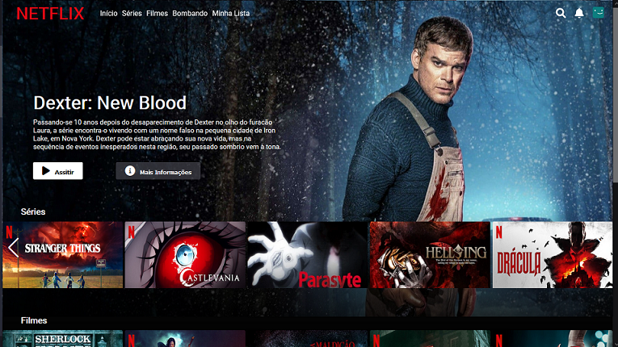

# Dio - Netflix Clone

Este é um desafio da [Dio](#). A dio é um plataforma de ensino gratuído que fornece cursos e projetos, além de fornecer oportunidades de vagas no mundo da tecnologia.

## Conteúdo

- [Overview](#overview)
  - [Screenshot](#screenshot)
  - [Links](#links)
- [Me processo](#my-process)
  - [Ferramentas utilizadas](#built-with)
  - [O que eu aprendi](#what-i-learned)
  - [Próximos passos](#continued-development)
  - [Fontes de auxilio](#useful-resources)
- [Autor](#author)


## Overview

### Screenshot




### Links

- Solução: [Netflix - clone](https://github.com/queziafiladelfo/clone-netflix)
- Live Site URL: [DEMO](https://queziafiladelfo.github.io/clone-netflix/)

## My processo

### Ferramentas utilizadas

- Semantic HTML5 markup
- CSS custom properties
- Flexbox
- Mobile-first workflow
- [Styled Components](https://styled-components.com/) - For styles
- [Swiper](https://swiperjs.com/)

### O que eu aprendi

EM CONSTRUÇÂO
<!-- 
To see how you can add code snippets, see below:

```html
<h1>Some HTML code I'm proud of</h1>
```
```css
.proud-of-this-css {
  color: papayawhip;
}
```
```js
const proudOfThisFunc = () => {
  console.log('🎉')
}
``` 

If you want more help with writing markdown, we'd recommend checking out [The Markdown Guide](https://www.markdownguide.org/) to learn more.
-->

### Próximos passos

Tem muito ainda para melhorar, penso em adicionar algumas funcionalidades, como  as listadas abaixo
- header:
  1. logo 				                [x]
  2. menu ao lado do logo 		        [x]
  3. menu a direita com poupUp 		    [x]
  4. menu fixo 				            [x]
  5. manipular cor do topo com o scrool 	[x]
  6. ícone direita lupa: add pesquisa     []
  7. ícone direita sino: add notificações [x]
  8. ícone direita avatar: add menu       []
- Pagina:
  1. responsividade                       []
  2. video auplay no banner               []
  3. mudar imagens staticas para um servidor de imagens []

### Useful resources

- [Imagens de logos](https://pngimg.com/images/logos/netflix) - Aqui tem algumas logos ára referência.
- [mdn web docs](https://developer.mozilla.org/pt-BR/docs/Web/CSS) - Me ajudou com documentação sobre html e css.
- [User Account Dropdown Menu using Html CSS & Vanilla Javascript](https://www.youtube.com/watch?v=04u09KBBjfM) - Vídeo sobre dropdown
- [CSS-Only Accessible Dropdown Navigation Menu](https://dev.to/5t3ph/css-only-accessible-dropdown-navigation-menu-1f95)


## Author

- Linkedin - [Quézia Filadelfo](https://www.linkedin.com/in/queziafiladelfo/) 


